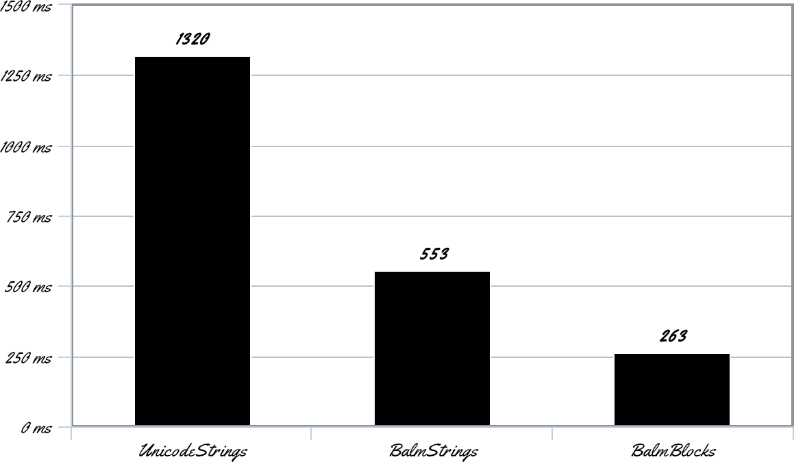
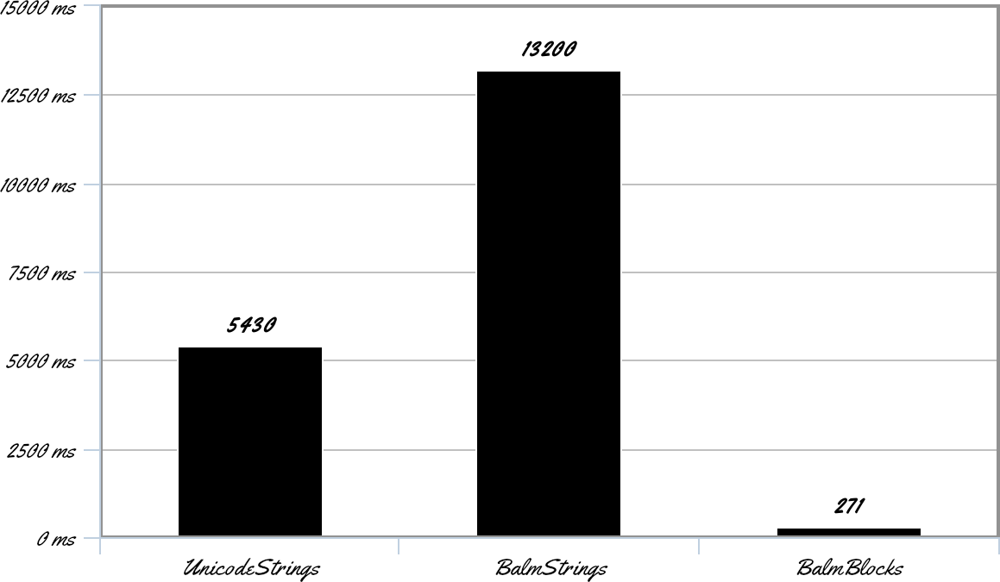

# balmbench

This is a quick benchmark for the techniques described in
[this](https://blog.vito.nyc/posts/gil-balm/) blog post.

This is more about the idea than implementation, but the relevant code is
under `src/Balm` if you want it.

## Benchmarks:

### Single Threaded

### Multi-Threaded

